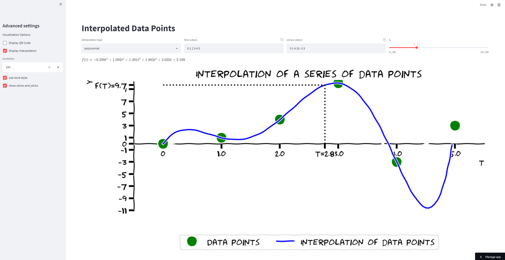

# Animation of Interpolation

[](https://share.streamlit.io/PhiSpel/spielbeispiel-interpolation/main)
[](https://creativecommons.org/licenses/by-sa/4.0/)

This is a simple web app demonstrating the interpolation of a set of data points. It is largely based on an [example by joergbrech](https://share.streamlit.io/joergbrech/truncated-taylor-series/main). [Click here](https://share.streamlit.io/PhiSpel/spielbeispiel-interpolation/main) to launch the app. This app is built using python and streamlit.



To run locally, enter the following commands into a terminal to install all requirements first:

```
git clone https://github.com/PhiSpel/spielbeispiel-interpolation.git
cd spielbeispiel-interpolation
pip install -r requirements.txt
```

Start the app with

```
streamlit run streamlit_app.py
```

Your browser should now open and display the app.

Shield: [![CC BY-SA 4.0][cc-by-sa-shield]][cc-by-sa]

This work is licensed under a
[Creative Commons Attribution-ShareAlike 4.0 International License][cc-by-sa].

[![CC BY-SA 4.0][cc-by-sa-image]][cc-by-sa]

[cc-by-sa]: http://creativecommons.org/licenses/by-sa/4.0/
[cc-by-sa-image]: https://licensebuttons.net/l/by-sa/4.0/88x31.png
[cc-by-sa-shield]: https://img.shields.io/badge/License-CC%20BY--SA%204.0-lightgrey.svg
